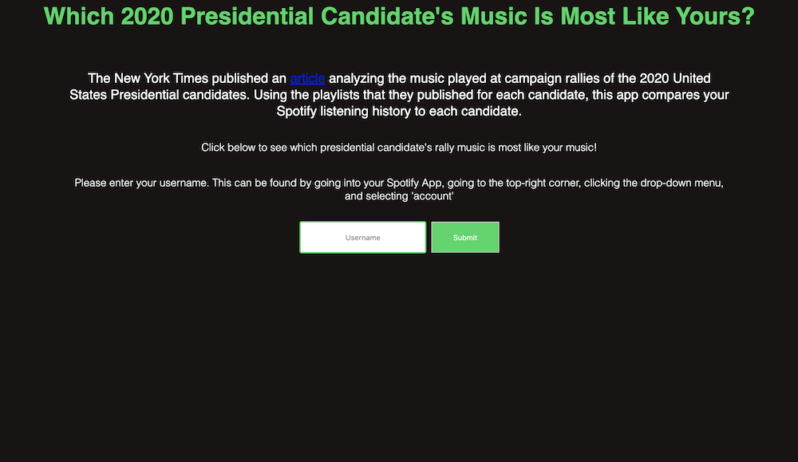
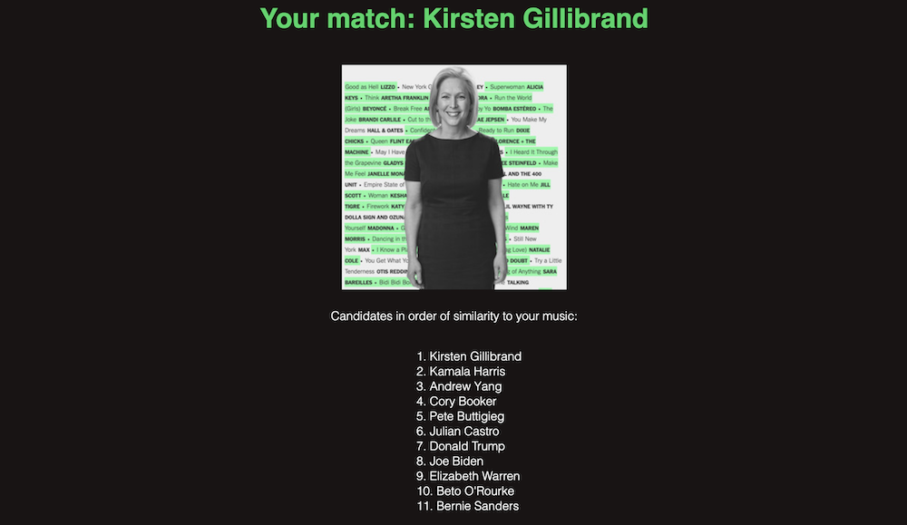

# Spotify Presidential Candidates

  

The New York Times published an [article](https://www.nytimes.com/interactive/2019/08/19/us/politics/presidential-campaign-songs-playlists.html?smtyp=cur&smid=tw-nytimes) analyzing the music played at campaign rallies of the 2020 United States Presidential candidates. The article is really interesting and the graphics are very well done---definitely give it a read!

Using the playlists that they published for each candidate, this app compares your Spotify listening history to each candidate and tells you whose campaign music is most similar to your music.

# Usage

Unfortunately, at this point I don't really have the time/resources to host this app online for easy public use. Maybe I'll come back to it later in the election cycle and give it a shot. For now, if you want to use the app you can follow the instructions below to run it locally on your computer:
1. The app uses Spotify API keys that can't be posted publicly. If you want to use the app, shoot me an email at matthew.mutammara@gmail.com and I'll send you the keys!
2. Download the repository and place the keys.py file that I send you in that folder with the rest of the files.
3. Make sure you have Python 3 installed with all the packages listed in requirements.txt (I'd recommend creating a [virtual environment](https://uoa-eresearch.github.io/eresearch-cookbook/recipe/2014/11/26/python-virtual-env/) and [using pip to install the packages from requirements.txt](https://stackoverflow.com/questions/7225900/how-to-install-packages-using-pip-according-to-the-requirements-txt-file-from-a))
4. Open up your terminal and navigate to the app's directory
5. Run the command `python main.py`
6. Open up your web browser and go to `localhost:6969`
7. Type in your Spotify username and click Submit
8. You will likely be asked to log in to Spotify, then redirected to a `404: Not Found` page. At the same time, your terminal window will say something like `Enter the URL you were redirected to`. Copy/paste the URL from the `404: Not Found` page into the terminal and press `Enter`. 
9. You should see some loading information in the terminal as the application runs
10. After about 10-20 seconds, you should see your results!

# The Process

With no real metric for evaluating the music someone listens to, I turned to the [Spotify API](https://developer.spotify.com/documentation/web-api/) for ideas. I eventually settled on the following implementation:

1. I create a **listening profile** for a user as follows:
	- **Top artists:** I compile the user's top artists using [this endpoint](https://developer.spotify.com/documentation/web-api/reference/personalization/get-users-top-artists-and-tracks/). I consider top artists over short-term (the past 4 weeks), medium-term (the past 6 months), and long-term (the past several years.)
	- **Genres:** I find the most commonly occurring genres across these artists and store them weighted by frequency.
	- **Top tracks:** I compile the user's top tracks using [this endpoint](https://developer.spotify.com/documentation/web-api/reference/personalization/get-users-top-artists-and-tracks/). I also add the top 10 tracks of each of the user's top artists using [this endpoint](https://developer.spotify.com/documentation/web-api/reference/artists/get-artists-top-tracks/). From here, I use [this endpoint](https://developer.spotify.com/documentation/web-api/reference/tracks/get-several-audio-features/) to get **audio features** for each track and average across them to build a picture of the type of music based on things like danceability, energy, and tempo.

 2. I follow the same procedure to create a listening profile for each of the presidential candidates based on their campaign rally playlists.

 3. I compare the user profile to each candidate. My procedure for comparing two profiles is as follows:
	 - Compute the [Euclidean distance](https://en.wikipedia.org/wiki/Euclidean_distance) between the two users' average audio features from their top tracks. Call this **audio_dist**.
	 - Compare the lists of top artists and compute what proportion of artists overlap. Call this **artist_overlap**.
	 - Compare the lists of genres and compute what proportion of genres overlap. I only include genres that apply to more than 10% of a user's artists. Call this **genre_overlap**.
	 - I define the difference between two profiles as:
	 >**audio_dist** x (1- **artist_overlap**)2 x (1-**genre_overlap**)

I square the artist component because I felt that listening to the same artist as someone is more significant than simply listening to music from the same genre or with similar audio features.

4. Finally, I rank each candidate based on their distance from the user as calculated above (with smaller distance meaning more similarity).

# File Structure
`main.py` - Runs the Flask API and handles Spotify authentication.

`functions.py` - Contains functions that handle the logic/math of our music analysis.

`candidates.py` - Contains hard-coded values linking candidates to existing Spotify playlists of their campaign rally music.

`templates/*` - HTML templates for the web pages that load when you use the app.

`requirements.txt` - Frozen list of dependencies on the virtual environment used to run the application.

`keys.py` - Not included here, but contains API keys needed to access Spotify API endpoints.

# Dependencies

`requirements.txt` contains the complete list of required packages for this project, but I just wanted to highlight the main components below:

[`spotipy`](https://spotipy.readthedocs.io/en/latest/) - Helpful Python wrapper on top of Spotify API endpoints.

[`Flask`](https://palletsprojects.com/p/flask/) - Lightweight [WSGI](https://wsgi.readthedocs.io/) web application framework that's super easy to use for people who don't have much frontend experience.

[`NumPy`](https://numpy.org) and [`pandas`](https://pandas.pydata.org) - Everyone's favorite tools for organizing and handling data.

# Future Work

### Smarter computation
I don't really like the idea of averaging musical features across songs to compute a user's "average features". Averaging can cause us to lose information and create meaningless and even misleading profiles of users. Take for example someone who usually listens to 2 kinds of music: very sad music and very happy music. If you average the "energy" of all their songs together, you'd think they tend to listen to pretty medium level energy music. Not only do you miss out on the music they listen to, but you also now think that they listen to something that they never listen to! 

Most people listen to different kinds of music. That's why Spotify recommends [up to six Daily Mix playlists](https://newsroom.spotify.com/2018-05-18/how-your-daily-mix-just-gets-you/) for you instead of just one big "music you like" playlist. In the future, I'd like to use [clustering](https://en.wikipedia.org/wiki/Cluster_analysis) to learn several distinct types of music that a person likes and then search for each of these individually among candidates.

I will say that I think looking for overlap in genres and artists should help compensate for this a bit, but I think we can still learn more meaningful features for comparison using this approach.

### More candidates
Initially, the app compared the user to all of the candidates included in the [New York Times article](https://www.nytimes.com/interactive/2019/08/19/us/politics/presidential-campaign-songs-playlists.html?smtyp=cur&smid=tw-nytimes) that inspired the app. Since the article was published, I've seen a couple opportunities to add to this list:
1. **Andrew Yang** - The guy is polling as well as other people in the article and has been in the last couple debates so I added him to the app. His campaign manager published his rally music (found in [this Billboard article](https://www.billboard.com/articles/columns/rock/8502572/2020-presidential-candidates-rally-songs)) so I'm using that for him.

2. **Barack Obama** - Obviously not a candidate in this election, but Obama recently [tweeted his Summer 2019 playlist](https://time.com/5660856/barack-michelle-obama-summer-2019-playlist/) and I thought that might be a fun thing to add later. It should be noted though that there's a difference between music that you've been listening to and music that you play at your campaign rallies. I'd imagine that rally music is selected to be deliberately positive, hopeful, maybe even patriotic. It also isn't necessarily even chosen by the candidates themselves, so this playlist might not quite fit with the rest of them.

### Hosting the app online
My biggest regret with this app was not having the time to host it online for people to use easily. American election cycles are long though, so maybe some time closer to the election I'll have time to come back and make it usable for everyone!
